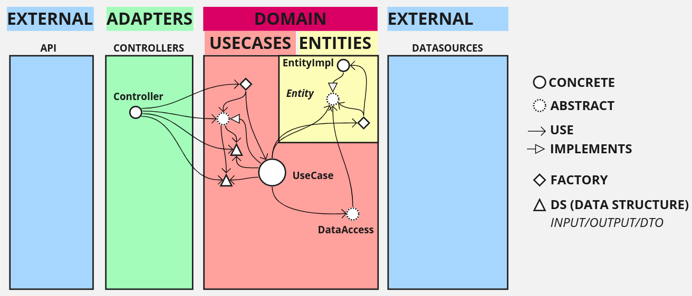

# Project Architecture

This project goal is to replicate a Clean Architecture and apply some concepts to it. 

The architecture designed here is made to isolate frameworks from the core business, which means we only are allowed to have spring/frameworks on the external layers. It enforces the architecture boundaries by spreading the project into different maven modules. It also removes some unnecessary layers since the actual context won't need it (YAGNI).

So, let's start with UB's (Uncle Bob) representation of Clean Architecture.

*https://blog.cleancoder.com/uncle-bob/2012/08/13/the-clean-architecture.html*

If you spend some time in this onion structure and read the book you will find a lot of interesting concepts, but the most important part IMO is the "flow of control" described at the bottom right corner. By understanding it we can disassemble the onion and spread it into vertical layers.

Note that this diagram is just a basic representation, it doesn't contain all the necessary elements to apply CA to its full. Still, there are a lot of elements to it.

Now, for this project, we won't name layers exactly as UB depicted, so we will just change the external layers Frameworks and Drivers to **External**, the Interface Adapters to just **Adapters**, and the core layers to **Domain**. By doing so we will end up with the following:

Then we can name the internal layers.

Now, here is the part where we will change the architecture a little bit, since this project is an API and doesn't have more than 1 type of output info, we don't need an adapter to abstract it, so we will cut the **Presenters** out. The same goes for our data sources, since we won't have more than one source of data, we will also remove the **Gateways**.

So our architecture design now looks like this:

Note that these layers can be added later if needed, as the project grows, a constant refactor is mandatory to keep the architecture quality. 

By using the maven multi-module feature we will have the following module structure:

Now, let's go back and fill our design with our elements. From inside out, starting with our entities.

The entities are pretty simple, they represent your enterprise business rules, which means we can apply some DDD concepts here. Our entity is abstracted with an internal implementation only and its instances are created by a Factory. Here, our entities and value objects follow some of the DDD guidelines.

Moving on to the Use Cases:

Now, here it starts to get messy with a lot of elements. As you can see an UseCase is abstract and defines an Input Data Structure (DS) and an Output DS, the input is used as a parameter and the output is returned. The factory there is responsible for knowing which use case implementation is the right one and creating it.

The Use Case also makes use of the entities by using the Factory and the DataAccess to retrieve objects. The DDD repositories here are the same as the DataAccess represented in the image, and in some way, our UseCases are the same as the application services from DDD.

Moving on towards the API, we have the controllers:

A controller is a simple pattern meant to abstract the use of a routine, you can learn more about it by reading about GRASP concepts. 

We finally reach the REST API:

At this point, it's needed to map some objects, so since we are having a HATEOAS endpoint we will make use of Spring hateoas project and use its RepresentationModel. By doing so we will need to map the outputs received from the controller and in some cases the inputs to pass them into the controllers.

We will also define a Factory to delegate the responsibility of generate the hateoas links to it.

Now, going back, on the other side of the architecture the UseCases uses the DataAccess abstractions to have access to data.

The DataAccess implementation is a DataSource that will define where it will fetch access from. Here we also have Spring, and the DataSource is a `@Service` that makes use of a `@Repository`. 

Since our domain entities could be different from their stored data representation, it's also necessary to have another mapper here, that converts the `Entity` to a `JpaEntity` and vice-versa. By doing so, our `JpaRepository` uses or `JpaEntity` which is converted to an `Entity` before returning to the UseCases that requested it.

Now, the arrows are a little bit messy, so we will just remove some arrows that represent some transient dependencies. The dependencies are still there tho.

Finally, we can see the outside world. So, a web application or another (micro)service could make use of the REST endpoints, and on the other side of the architecture, we fetch data from a PostgreSQL database by using JPA/Hibernate.

Notice that we only have Spring at the External Layers, so we could make another PoC without Spring, with Quarkus for example, and use the same jars from the adapters and the domain layers.

This is just a project decision, note that if it was decided to use Spring in the internal layers (adapters and domain), the code would be much cleaner and simpler. However, it's a project decision to marry a framework and keep the business components attached to it.

# Tests

JUnit, Mockito, and AssertJ are used to test all layers of this project's architecture. The tests are pretty simple since the architecture allows the components to be more functional (style).

On the external layers, however, we use more than those frameworks, making use of the Spring MockMvc to test the Rest Controllers and the Spring REST Docs to generate a `.adoc` documentation based on our tests. The AsciiDoctor plugin will parse the documentation into two different formats, an HTML and a Docbook. 

There is also a separated CI routine that parses the Docbook to MarkDown format, it uses Pandoc to do so. So, we have our REST documentation semi-automagically generated by our tests, and into 3 different formats.

To test the repositories, it's done on two sides, on the API side, we have integration tests that are using an in-memory database H2, autoconfigured by SpringBoot. 

However, on the other side, in the DataSources layer, we don't use the in-memory database and use a more closely related database to our chosen RDBMS Postgres, so we make use of TestContainers.

TestContainers will configure and launch a docker container with the database from scratch for us to run our tests. It's slower than H2 but it gives more credibility to our integration tests. 

The database is also configured with Flyway for migrations. It works and runs the migrations in both tests, the in-memory database H2 and the docker Postgres database.

# Code Quality

SonarQube code quality analysis is done by using SonarCloud and GitHub Actions. There is a minimum of test coverage configurated and the coverage report is done by using JaCoCo.

Note that since it's easy to test each component in this architecture, the code coverage is naturally high. By using Clean Architecture the project naturally adheres to SOLID principles and it's easier to apply Clean Code since the components are small and functional.

# Development Process

The project started with a planning explained at the Project Domain document, after that the initial development was meant to set a minimum structure of all working components, so a simpler domain (customer) from the planning was picked for it.

With the full architecture defined, we can move to the other domains (order and product) and keep growing the project as needed, note that a constant refactor is mandatory for a good architecture, so the design may change along the way.