# Project Domain

## Story

We have a customer with an Address. \
This customer is going to place an order. \
The order can have multiple items in it. \
We would like to verify the order status before shipping it to the customer address. \
The items that the client will place in it's order are products on our local store. \
Our products are spread into different categories. \

We first register or customer basic data, like name, email and his shipping address. \
We would like to filter our customers and check his order history. \
The then customer can place an order with as many items he would like. \
Each product has a price and can be browsed through categories. \
The order should start with a "IN CART" status, after that "WAITING PAYMENT" and then "CONFIRMED" or "REFUSED". If the order was "CONFIRMED" it will be delivered.

Please note that this is a really short and lacking description of a product, and also one of the most common "examples" shown in many tutorials out there. I am letting my imagination flow along with the modeling process.

## DDD

Now, these steps and models are way far from an actual DDD process. My knowledge about DDD is at basic level, and this is just an experimentation of how would things adapt to a Clean Architecture style.

So we have some entites from the story above.

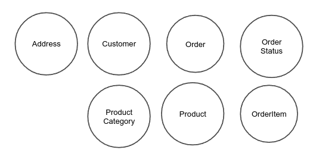

They all could be inside the same aggregate since this is just a PoC and won't grow any further, but if we try to think about responsibilities and who would be in charge of what, we can split them into three different aggregates.

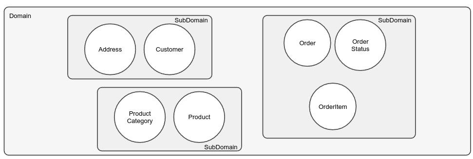

After that, I think we can start drawing some relationships.

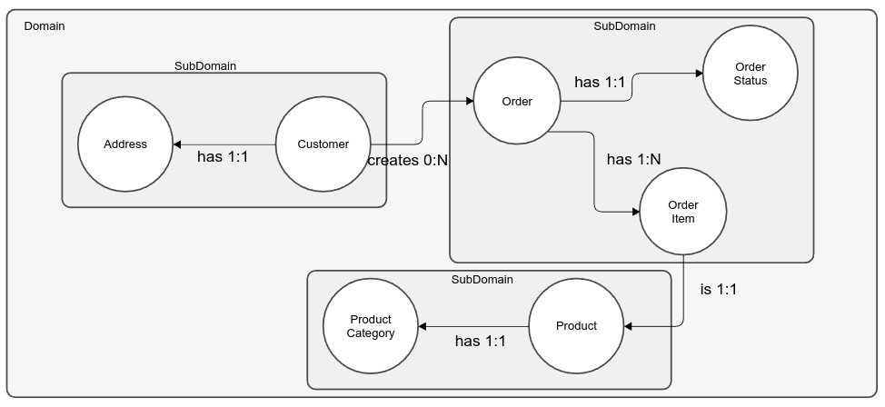

Let's name our bounded contexts.

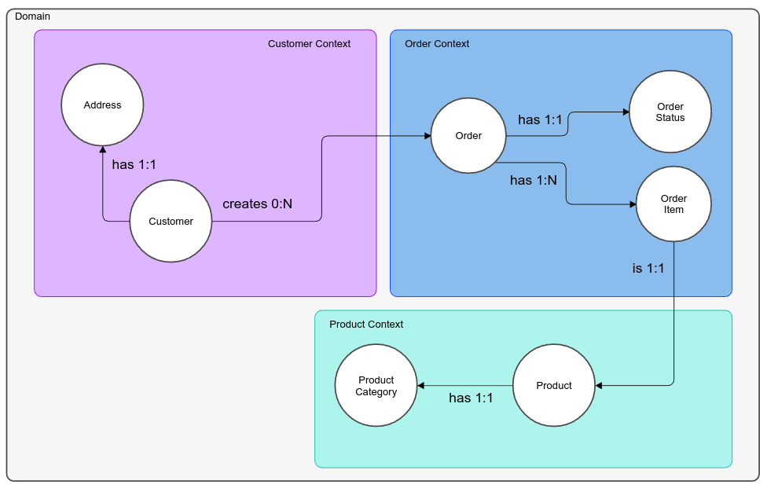

Since we split them into three different contexts, later on, we could split them also into three different microservices. (But it's not the purpose here)

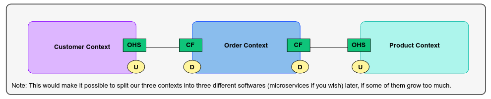

Alright so in DDD we have Value Objects and these "weak" relation between contexts, which are made only by Ids and not the Object itself, making possible a "decoupling" into different software.

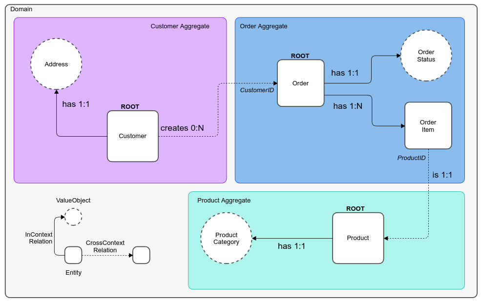

Alright, so let's abuse of some UML power now. \
We finally have some classes.

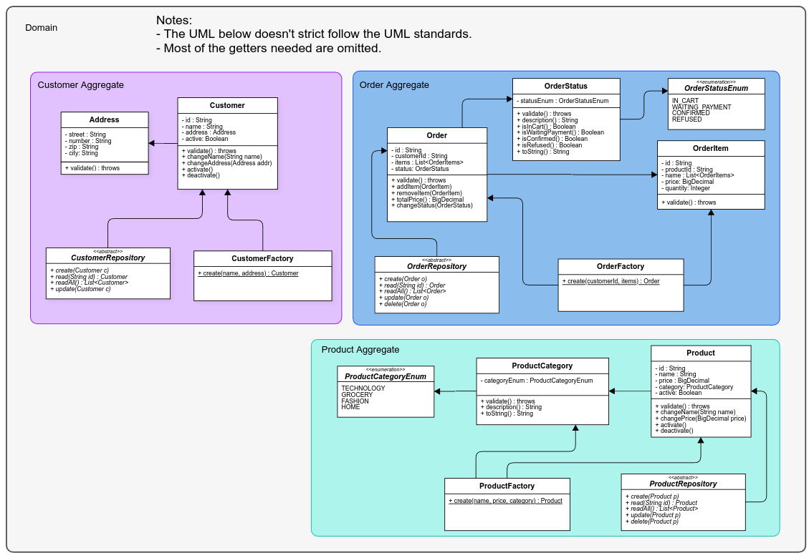

Be aware that this is not a domain using the full power and tools of DDD. \
DDD is recommended for complex software, and has a lot of tooling specially made for those cases.

## Clean Architecture

Now, here the concepts between DDD and Clean Architecture start to go astray.

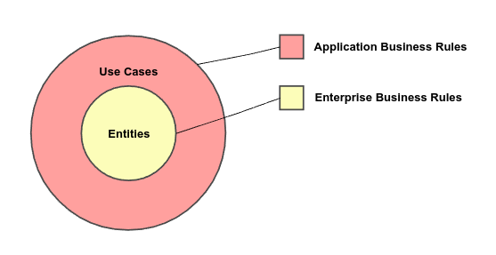

Clean Architecture has Entities, and DDD also has Entities. \
However, the "Aggregate" on DDD is quite rich compared to the "Entities" layer on Clean Architecture. \
Of course, we could enrich our Entities layer by applying DDD concepts, but that begins to entangle quite fast. \
A few examples are the DDD "Repository", "Factory" and "Event" concepts. \

As you may know, each aggregate should have its Repository and Factory, however, where is it in a Clean Architecture style? IMHO, the UseCase layer which has an abstract repository (Data Access) to call the persistence layer. 
By doing this, we blended the DDD "Aggregate" into two Clean Architecture layers, and it's fine, since both UseCase and Entities layer should be business oriented. \

Of course, we could also keep these abstractions inside the Entities layer, but then we would start to give DDD concepts more weight than Clean Architecture, which is not the purpose here. But if you want a really strong domain layer, by all means, give DDD more weight.

Also, whereas in DDD we have an Application Layer and Domain Layer, in Clean Architecture we have an UseCase Layer and Entities Layer.
So, let's change it a little bit.

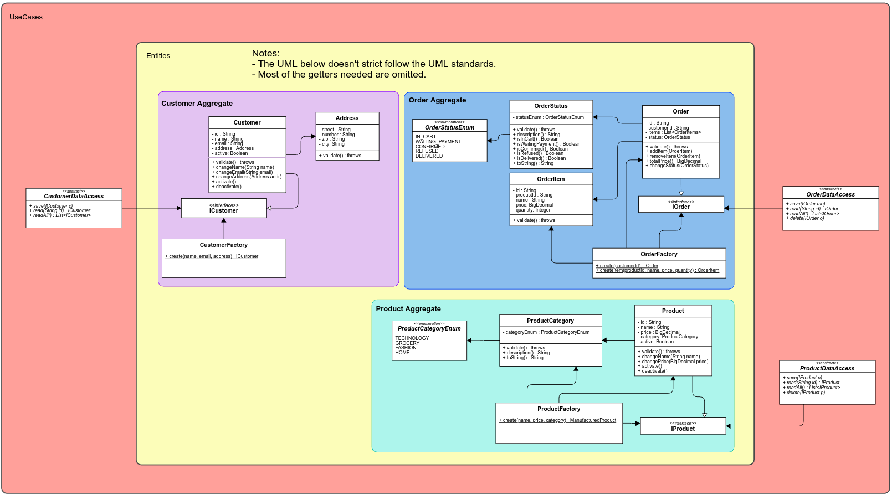

We separated our Domain into the Clean Architecture Layers, also note that the "Repository" now is called "DataAccess". \
The DataAccess uses an Interface of the Aggregate root.

The aggregate root (entity) has a protected constructor that the Factory can access (since it's in the same package). \
This will "force" the DataAccess implementations to use the entity Factory to create the aggregate root. \
Of course, it's still possible to bypass it, but it's "harder" than just direct instantiating the aggregate root with `new`.

Now, from here we should start thinking of Clean Architecture instead of DDD. \
So, our software now is Use Case oriented. \
Use cases that we should have well documented before we started our modeling process, but well... hahaha. \
It's important to note this, because the use cases and the project planning would define how the entities, properties, and factories would be, not the other way around (like this one, Oops).

Let's just think about some simple processes:
- Our employee is going to register and update all products from the local store.
- Our employee is going to register a new customer if needed.
- The customer can open a new order. (OrderStatus = IN_CART)
- The customer can add all items he wants from the local store.
- The customer can finish the order to proceed with the payment. (OrderStatus = WAITING_PAYMENT)
- After paying the order, the OrderStatus changes either to CONFIRMED or REFUSED.
- Once the order is CONFIRMED, the items are delivered (OrderStatus = DELIVERED).

Note: I won't cover a full online store use case, of course, I am just trying to make it simple and small enough for a POC Project. \
Some stuff will also be left at random implementations, like payment and delivery, which brings complexity enough to not be in this project.

This picture demonstrates what Uncle Bob's meant by Use Cases.
So let's follow this structure and create some of our use cases with the processes above mentioned.

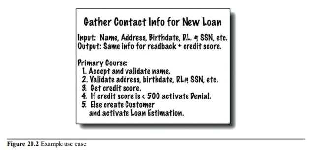

Use Cases:
- Create a new Product.
- Update Product data.
- Create a new Customer.
- Update Customer data.
- Create a new Order.
- Add item to existing Order.
- Remove item from existing Order.
- Checkout the existing Order.
- Pay the Order.

Note that payment is a process that takes some time and we won't dive into it.
So, our Pay the Order use case will randomly confirm or refuse the order.
If confirmed we then automatically mark it as DELIVERED, since we don't have a shipping/delivery context too.

Alright, so we have some use cases. But we might have more of them. 
Let's think about a some more:
- Find all Products.
- Find Products by name.
- Find Customers by name.
- Find Orders by Customer.

Let's describe them all. And use this "card" style, as UB.

The Product Aggregate:

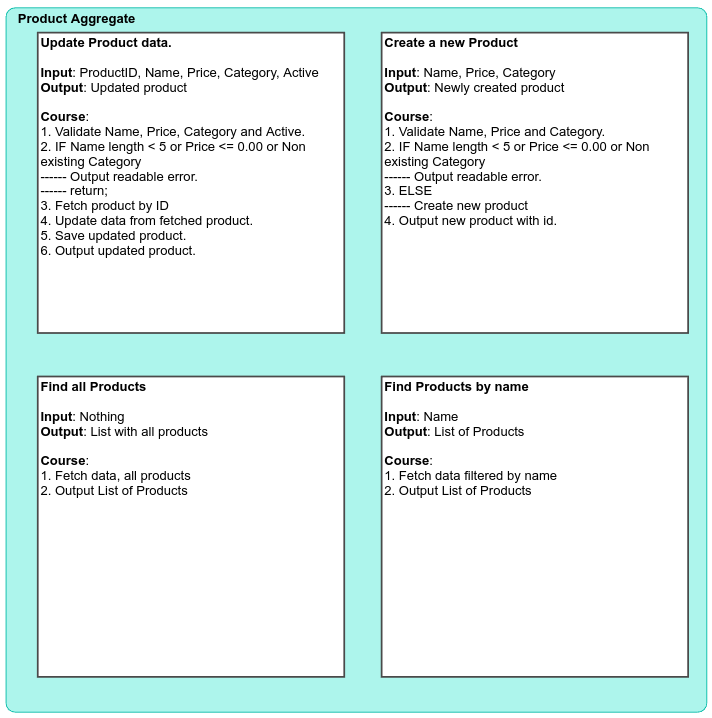

The Customer Aggregate:

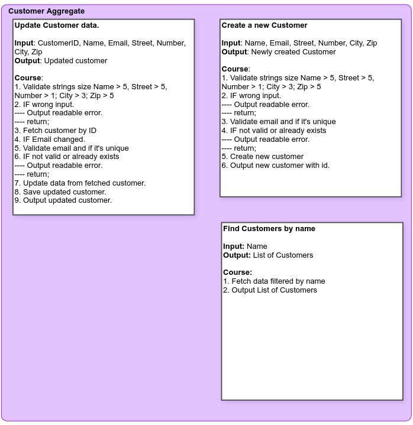

The Order Aggregate:

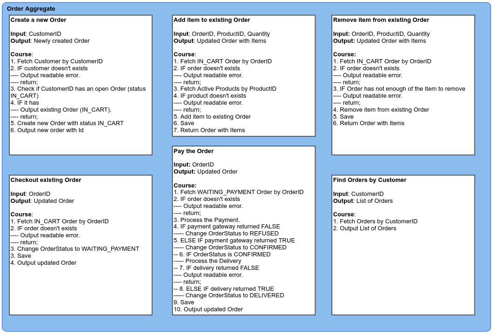

Alright, our PoC project is starting to become a little big for a PoC. \
But it's ok, it's better than a simple crud of two entities.

Now, we should have enough understanding of our domain to start coding.

So, where should we start? Let's start with the smallest aggregate (Customer).

By going with the smallest aggregate we can push all layers and focus on architectural problems, enforced boundaries, and code quality earlier.

After that, the other aggregates implementations can follow the existing guidelines.

Enough with planning, let's code.